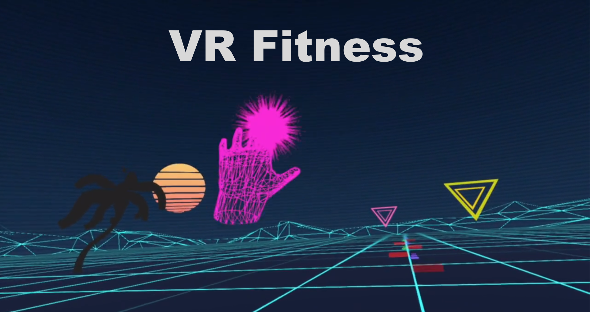

# VRFitness

Created during the Reality Virtually VR/AR Hackathon at MIT, <b>VR Fitness</b> blends the fun gameplay elements of the VR Rhythm Game genre popularized by [Beat Saber](https://www.youtube.com/watch?v=vL39Sg2AqWg) and [AudioShield](https://www.youtube.com/watch?v=RMayj9D_uCQ) with the aerobics craze of the 1980's popularized by workouts such as [Jazzercise](https://youtu.be/pkwLL20GOwE?t=159) and Jane Fonda's [Step Aerobics](https://youtu.be/dk5MsYylykM?t=22).

Players wear an [HTC Vive](https://www.vive.com/us/product/vive-virtual-reality-system/) headset, hold [Vive Controllers](https://www.vive.com/media/filer_public/ac/85/ac8560e4-8d7f-42b6-9394-8fa6d5064b4e/controller_01.jpghttps://www.vive.com/us/vive-tracker/) in their hands, and strap [Vive Trackers]() on top their feet. This allows <b>VR Fitness</b> to provide the player with different colored hand and foot models which move with their body parts. During each exercise sequence, players punch and kick the targets coming at them by matching the color of their hand/foot with the color of the target. Additionally, various obstacles come towards the player that they must duck, dodge, and step over. The patterns of the targets and obstacles were created to get the player to perform common aerobic exercise ([standing reach](https://www.shape.com/sites/shape.com/files/styles/slide/public/exercise/v-step-1_1.jpg), [leg crunch](https://www.shape.com/sites/shape.com/files/styles/slide/public/exercise/grapevine-step-4_0.jpg), etc.) moves to the music. A seated exercise routine was also included to show how the game can be used by those who can't exercise standing up (using [seated overhead reach](https://www.healthline.com/hlcmsresource/images/topic_centers/Fitness-Exercise/400x400_Stretches_to_Do_at_Work_Every_Day_Overhead_Reach.gif), for example) and for physical therapy.

More details about the project & team, including a gameplay video, can be found at the [<b>VR Fitness</b> Devpost](https://devpost.com/software/vr-fitness) page.

<i>Note: Project requires Unity 3D 2018.3 or later to build and SteamVR runtime, HTC Vive with 2 Controllers, and 2 Vive Trackers to properly run.</i>

If you just want to try out the demo, you can download it [here](https://www.dropbox.com/s/k872v3vr04lz4ba/VRFitnessDemo.zip?dl=1).
